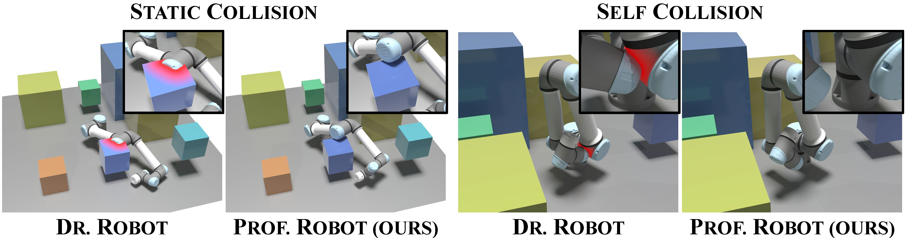

<div align="center">

# Prof. Robot: Differentiable Robot Rendering Without Static and Self-Collisions

### CVPR 2025 (Poster)
[Quanyuan Ruan†](https://qrcat.github.io/)<sup>1</sup>, [Jiabao Lei†](https://jblei.site/)<sup>1,2</sup>, Wenhao Yuan<sup>1</sup>, [Yanglin Zhang](https://github.com/lucky9-cyou/)<sup>1,2</sup>, Dekun Lu<sup>1</sup>, [Guiliang Liu*](http://guiliang.me/)<sup>1,2</sup>, [Kui Jia*](http://kuijia.site/)<sup>1,2</sup>

<sup>1</sup>South China University of Technology, <sup>2</sup>School of Data Science, The Chinese University of Hong Kong, Shenzhen, <sup>*</sup> Equal Contribution, <sup>†</sup> Equal Contribution, <sup>*</sup> Corresponding authors

<div>
<button style="background-color: #007bff; color: white; border: none; padding: 10px 20px; border-radius: 5px; margin-right: 10px;" onclick="window.location.href='https://arxiv.org/abs/2503.11269'"><strong>Paper</strong></button>
<button style="background-color: #28a745; color: white; border: none; padding: 10px 20px; border-radius: 5px; margin-right: 10px;" onclick="window.location.href='https://github.com/qrcat/prof.robot'"><strong>Code</strong></button>
<button style="background-color: #ffc107; color: white; border: none; padding: 10px 20px; border-radius: 5px; margin-right: 10px;" onclick="window.location.href='/prof-robot'"><strong>Project</strong></button>
</div>

<div align="center">
  
</div>

<br>


This is the official repository for Prof. Robot, forking from Differentiable Robot Rendering.

## Usage

generate collision dataset:

```bash
python generate_robot_collision_data.py
```

train

```bash
python train_collision.py
```

## Acknowledgements 🙏

- [Dr. Robot](https://github.com/cvlab-columbia/drrobot)
